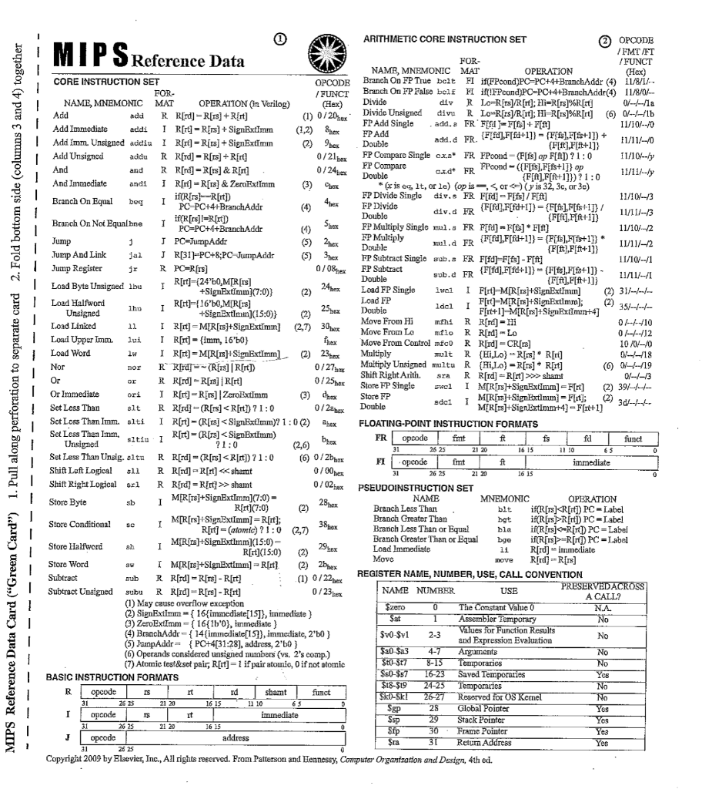

# MIPS to Binary to MIPS

This is a simple converter that helps to encode MIPS assembly instructions to binary and also decode binary machine code into MIPS instructions.

## What is MIPS

[MIPS](https://en.wikipedia.org/wiki/MIPS_architecture) (Microprocessor without Interlocked Pipelined Stages) is a reduced instruction set computer (RISC) instruction set architecture (ISA) developed by MIPS Computer Systems, now MIPS Technologies, based in the United States.

I made this as a fun project for my [Computer Organisation](https://www.comp.nus.edu.sg/~cs2100/) module (CS2100) taught by Dr Colin Tan and Aaron Tan :D to better familiarise myself with it.

## Features

- Decode binary/hex machine code into MIPS instructions
- Encode MIPS instructions into hex machine code

## Reference Data

